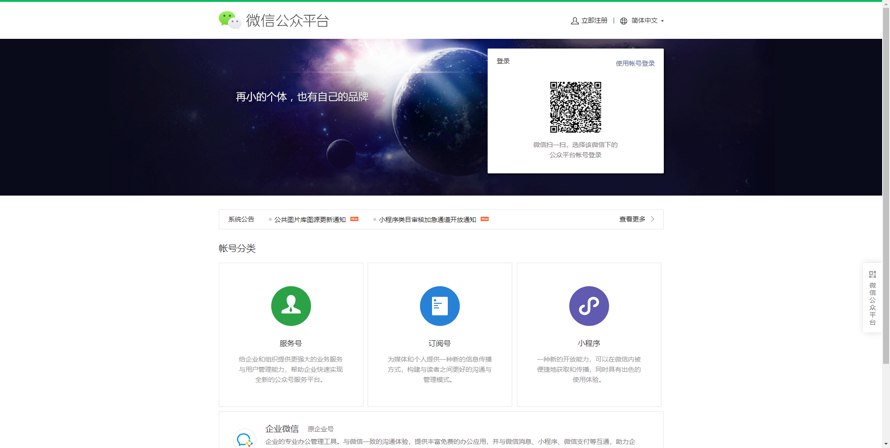
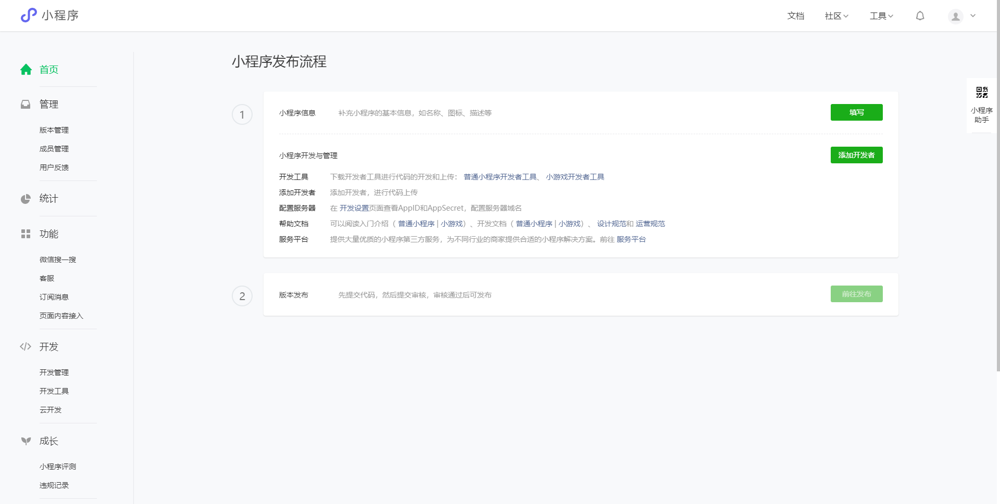
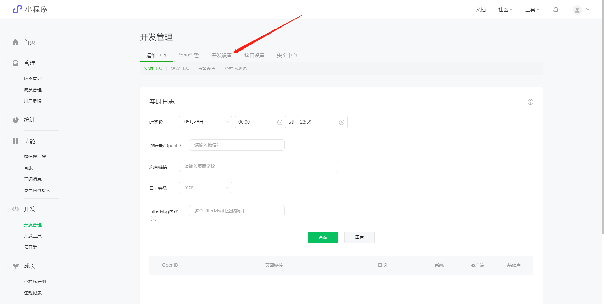
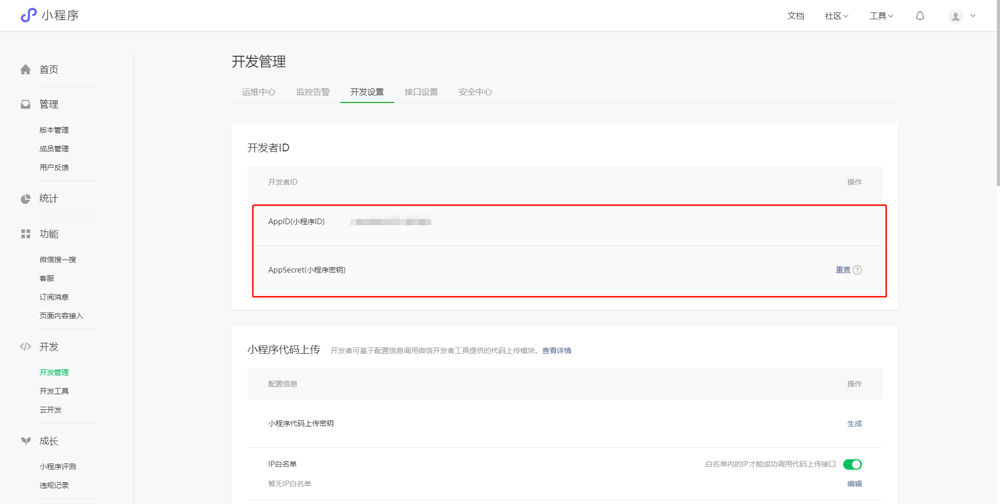
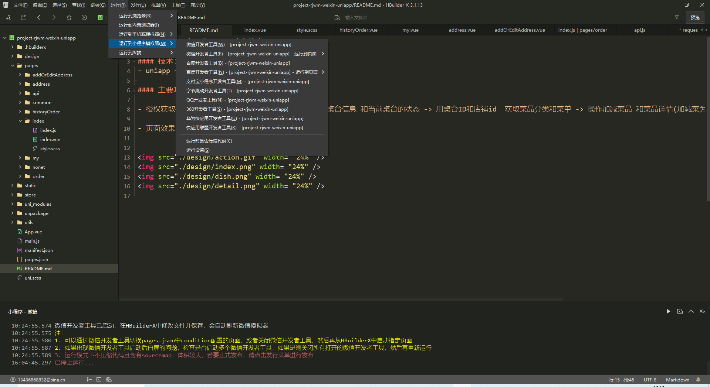
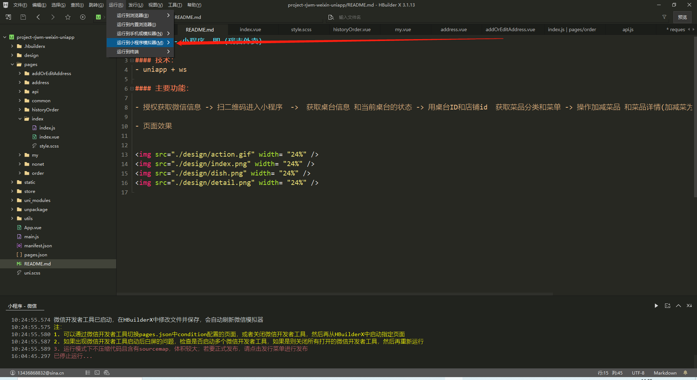

#### 苍穹外卖小程序流程说明

### 注册小程序AppID相关流程
---百度搜索[微信公众平台](https://mp.weixin.qq.com/),没有账号需要进行注册，进行扫码登录

找到开发管理



**注意：** appid生成，项目开发过程中要使用，或者临时使用测试号（后边介绍）



##### uni-app介绍 [官方网页](https://uniapp.dcloud.io/resource)

`uni-app` 是一个使用 [Vue.js](https://vuejs.org/) 开发所有前端应用的框架，开发者编写一套代码，可发布到iOS、Android、H5、以及各种小程序（微信/支付宝/百度/头条/QQ/钉钉）等多个平台。

即使不跨端，`uni-app`同时也是更好的小程序开发框架。

具有vue和微信小程序的开发经验，可快速上手uni-app

为什么要去学习uni-app？

相对开发者来说，减少了学习成本，因为只学会uni-app之后，即可开发出iOS、Android、H5、以及各种小程序的应用，不需要再去学习开发其他应用的框架，相对公司而言，也大大减少了开发成本。

##### 环境搭建

安装编辑器HbuilderX  [下载地址](https://www.dcloud.io/hbuilderx.html)

HBuilderX是通用的前端开发工具，但为`uni-app`做了特别强化。

下载App开发版，可开箱即用

安装微信开发者工具 [下载地址](https://developers.weixin.qq.com/miniprogram/dev/devtools/download.html)

##### 利用HbuilderX初始化项目

+ 点击HbuilderX菜单栏文件>项目>新建

+ 选择uni-app,填写项目名称，项目创建的目录

  


##### 运行项目

## ---新建项目

在菜单栏中点击运行，运行到浏览器，选择浏览器即可运行

在微信开发者工具里运行：进入hello-uniapp项目，点击工具栏的运行 -> 运行到小程序模拟器 -> 微信开发者工具，即可在微信开发者工具里面体验uni-app

在微信开发者工具里运行：进入hello-uniapp项目，点击工具栏的运行 -> 运行到手机或模拟器 -> 选择调式的手机


**注意：**

+ 如果是第一次使用，需要先配置小程序ide的相关路径，才能运行成功
+ 微信开发者工具在设置中安全设置，服务端口开启

## ---导入项目
在菜单栏中点击文件，选择导入，选择从本地目录导入


##### 介绍项目目录和文件作用

`pages.json` 文件用来对 uni-app 进行全局配置，决定页面文件的路径、窗口样式、原生的导航栏、底部的原生tabbar 等

`manifest.json` 文件是应用的配置文件，用于指定应用的名称、图标、权限等。

`App.vue`是我们的跟组件，所有页面都是在`App.vue`下进行切换的，是页面入口文件，可以调用应用的生命周期函数。

`main.js`是我们的项目入口文件，主要作用是初始化`vue`实例并使用需要的插件。

`uni.scss`文件的用途是为了方便整体控制应用的风格。比如按钮颜色、边框风格，`uni.scss`文件里预置了一批scss变量预置。

```unpackage``` 就是打包目录，在这里有各个平台的打包文件

```pages``` 所有的页面存放目录

```static``` 静态资源目录，例如图片等

```components``` 组件存放目录

为了实现多端兼容，综合考虑编译速度、运行性能等因素，`uni-app` 约定了如下开发规范：

- 页面文件遵循 [Vue 单文件组件 (SFC) 规范](https://vue-loader.vuejs.org/zh/spec.html)
- 组件标签靠近小程序规范，详见[uni-app 组件规范](https://uniapp.dcloud.io/component/README)
- 接口能力（JS API）靠近微信小程序规范，但需将前缀 `wx` 替换为 `uni`，详见[uni-app接口规范](https://uniapp.dcloud.io/api/README)
- 数据绑定及事件处理同 `Vue.js` 规范，同时补充了App及页面的生命周期
- 为兼容多端运行，建议使用flex布局进行开发